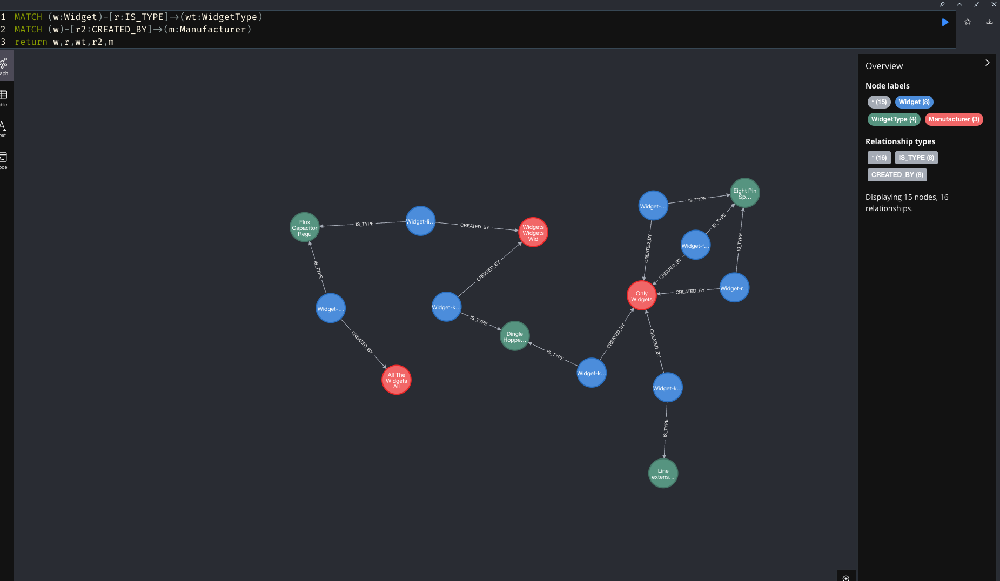

# JoesWidgets Test

# Prerequisites 

Both `node` and `npm` are needed. Project was built with node `18.13.0`

# Install
Inside of `client` dir run `npm install`. Inside of `server` dir run `npm install`. Inside `server` dir, copy `.env.example` to `.env` then copy the password, which should have been supplied by recruitment agent in their email, and paste in for the `NEO4J_PASSWORD=` variable.

# Run
Inside of `client` dir run `npm run start`. Inside of `server` run `npm run dev`.

# App

UI is available at http://localhost:4200 and Apollo server is available at http://localhost:4000. The app has a widgets page, a manufacturers page and a widget types page. All widgets have a type and manufacturer. Widgets/Manufacturers/Widget Types have full CRUD from within the UI using the Apollo gql server. I'm leveraging Neo4Js graphql - so any gql types are assumed to be nodes and you can specify relationships in the type definitions. So inside the Neo4j db I'm creating relationships between the widgets,types and manufacturers (image below).

# Decisions
## Database
Decided I wanted to use Neo4j as if I'm going to be writing code and I can enjoy myself then I will - I enjoy Neo4J. It's overkill for this basic setup hence why I had to add manufacturers and widget types, but I was thinking what if the widgets need more metadata, and what if they need to be linked to other bits of data. Which could be the case since you use Neo4J already.
## Client
Decided on Angular as it's my preferred js framework for frontend work, I added some basic tests to show you I can write tests. I also added tailwindcss as it's very nice for creating layouts and very quick. I also used Material for the components to make it look pretty.
## Improvements
More tests, pagination, visual display of graph. Also Neo4J's grahql is great but can be slow as the queries/mutations need to be dynamic, so potentially writing custom queries/mutations. Right now I'm ignoring the cache for Apollo - but if the app grew then the caching strategy would need an overhaul.
